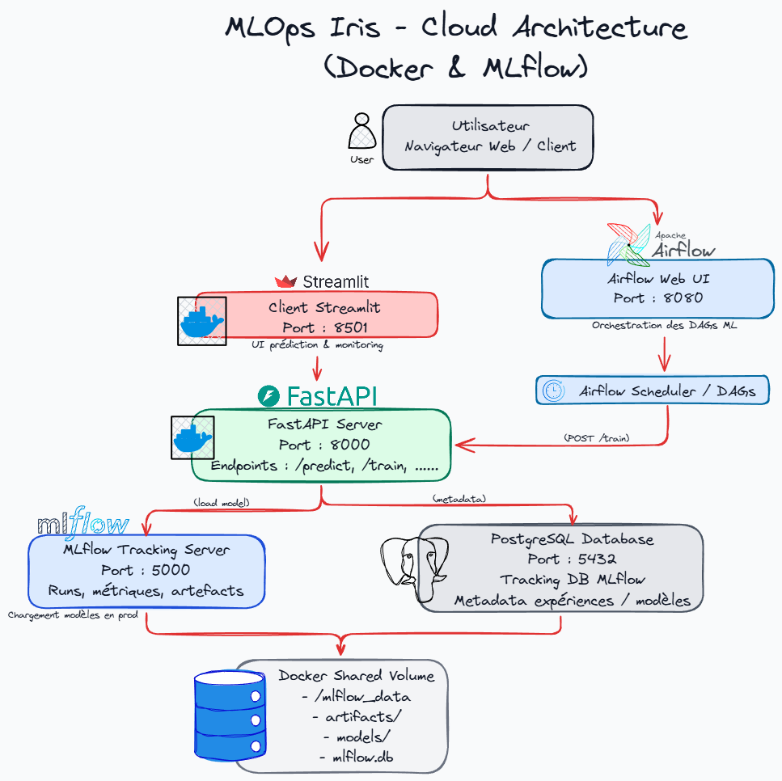

# 🌸 Iris AutoML - MLOps Pipeline Complete

[](https://www.python.org/downloads/)
[](https://fastapi.tiangolo.com/)
[](https://streamlit.io/)
[](https://mlflow.org/)
[](https://airflow.apache.org/)
[](https://www.docker.com/)
[](LICENSE)

**Plateforme MLOps complète** pour l'entraînement, le versioning et le déploiement de modèles de classification sur le dataset Iris, avec orchestration automatisée et interface utilisateur interactive.


---

## 🎯 Aperçu

**Iris AutoML** est une plateforme MLOps end-to-end qui démontre les meilleures pratiques de Machine Learning Operations à travers un cas d'usage classique : la classification des fleurs Iris.


---

## 🏗️ Architecture

### Vue d'Ensemble

<p align="center">
  
</p>


### Infrastructure MLOps

```
┌──────────────────────────────────────────────────────────────┐
│                      MLOPS PIPELINE                          │
├──────────────────────────────────────────────────────────────┤
│                                                              │
│  1. DATA INGESTION                                          │
│     └── Scikit-learn Iris Dataset                          │
│                                                              │
│  2. MODEL TRAINING (3 modèles)                              │
│     ├── RandomForest Classifier                             │
│     ├── Support Vector Machine                              │
│     └── Logistic Regression                                 │
│                                                              │
│  3. EXPERIMENT TRACKING                                      │
│     └── MLflow (params, metrics, artifacts)                 │
│                                                              │
│  4. MODEL REGISTRY                                           │
│     └── MLflow Registry (versioning, staging)               │
│                                                              │
│  5. MODEL SERVING                                            │
│     └── FastAPI REST API                                     │
│                                                              │
│  6. MONITORING & VISUALIZATION                               │
│     ├── MLflow UI (experiments & models)                    │
│     └── Streamlit (user interface)                          │
│                                                              │
│  7. ORCHESTRATION                                            │
│     └── Apache Airflow (scheduled training)                 │
│                                                              │
└──────────────────────────────────────────────────────────────┘
```

---

## ✨ Fonctionnalités

### 🎯 Core Features

#### 1. **Multi-Model Training**
- **RandomForest** - Ensemble learning avec arbres de décision
- **SVM** - Support Vector Machine avec kernel RBF
- **Logistic Regression** - Régression logistique multinomiale

#### 2. **MLflow Integration**
- **Experiment Tracking** - Suivi automatique de tous les runs
- **Model Registry** - Versioning et staging des modèles
- **Artifact Storage** - Sauvegarde des modèles et métriques
- **Model Comparison** - Comparaison des performances

#### 3. **Interactive UI (Streamlit)**
- Interface utilisateur moderne et intuitive
- Entraînement de modèles en temps réel
- Visualisation des métriques (confusion matrix, classification report)
- Prédictions interactives avec probabilités
- Affichage d'images des classes prédites
- Graphiques de distribution des probabilités

#### 4. **REST API (FastAPI)**
- API asynchrone haute performance
- Documentation Swagger automatique
- Endpoints pour training, metrics, predictions
- Validation des données avec Pydantic
- CORS enabled pour intégration frontend

#### 5. **Workflow Orchestration (Airflow)**
- Entraînement programmé (cron-based)
- Réentraînement automatique des modèles
- Monitoring des DAGs
- Alertes en cas d'échec

#### 6. **Containerization**
- Multi-container Docker architecture
- Docker Compose pour orchestration
- Services isolés et reproductibles
- Volumes partagés pour persistance

---

## Technologies

### Stack Principal

| Technologie | Version | Usage |
|-------------|---------|-------|
| **Python** | 3.9+ | Langage principal |
| **FastAPI** | 0.100+ | API REST backend |
| **Streamlit** | 1.0+ | Interface utilisateur |
| **MLflow** | 2.0+ | Tracking & Registry |
| **Apache Airflow** | 2.10.2 | Orchestration |
| **PostgreSQL** | 15 | Base de données Airflow |
| **Docker** | 20.10+ | Containerization |
| **Docker Compose** | 3.9 | Multi-container orchestration |

### Librairies ML

| Librairie | Usage |
|-----------|-------|
| **scikit-learn** | Modèles ML (RF, SVM, LogReg) |
| **numpy** | Calculs numériques |
| **pandas** | Manipulation de données |
| **matplotlib** | Visualisations |
| **seaborn** | Visualisations avancées |

### Autres Outils

| Outil | Usage |
|-------|-------|
| **joblib** | Sérialisation de modèles |
| **pydantic** | Validation de données |
| **requests** | Communication HTTP |
| **pytest** | Tests unitaires |

---

## 🚀 Installation

### Prérequis

- **Docker** >= 20.10
- **Docker Compose** >= 3.9
- **8 GB RAM minimum** 
- **5 GB d'espace disque**

### Installation Rapide

```bash
# 1. Cloner le repository
git clone https://github.com/votre-username/iris-automl-mlops.git
cd iris-automl-mlops

# 2. Créer les dossiers nécessaires
mkdir -p mlflow_data airflow/dags airflow/logs airflow/plugins airflow/postgres-data

# 3. Lancer tous les services
docker-compose up --build

# 4. Attendre que tous les services démarrent (~2-3 minutes)
```

### Accès aux Services

Une fois les services démarrés, accédez aux interfaces :

| Service | URL | Credentials |
|---------|-----|-------------|
| **Streamlit UI** | http://localhost:8501 | - |
| **FastAPI Docs** | http://localhost:8000/docs | - |
| **MLflow UI** | http://localhost:5000 | - |
| **Airflow UI** | http://localhost:8080 | admin / admin |

### Vérification

```bash
# Vérifier que tous les containers sont running
docker ps

# Devrait afficher :
# - server
# - client
# - mlflow
# - postgres
# - airflow-webserver
# - airflow-scheduler
```

---

## 📖 Utilisation

### 1️⃣ Via Interface Streamlit

#### Entraîner un Modèle

1. Ouvrir http://localhost:8501
2. Dans la sidebar, sélectionner un modèle (RF, SVM, LogReg)
3. Cliquer sur **"Réentraîner ce modèle"**
4. Attendre le message de succès avec l'accuracy

#### Visualiser les Métriques

1. Sélectionner un modèle
2. Cliquer sur **"Afficher les métriques"**
3. Consulter :
   - Accuracy globale
   - Matrice de confusion
   - Rapport de classification (precision, recall, f1-score)

#### Faire une Prédiction

1. Dans la sidebar "Caractéristiques de la fleur" :
   - Sepal length (cm) : ex. 5.1
   - Sepal width (cm) : ex. 3.5
   - Petal length (cm) : ex. 1.4
   - Petal width (cm) : ex. 0.2
2. Cliquer sur **"Prédire la classe"**
3. Visualiser :
   - Classe prédite avec image
   - Niveau de confiance
   - Distribution des probabilités

#### Charger un Modèle depuis MLflow

1. Section "Mise à jour depuis MLflow Registry"
2. Sélectionner un modèle et une version
3. Cliquer sur **"Charger modèle MLflow"**
4. Les métriques s'affichent automatiquement

### 2️⃣ Via API REST

#### Entraîner un Modèle

```bash
# RandomForest
curl -X GET "http://localhost:8000/train?model=rf"

# SVM
curl -X GET "http://localhost:8000/train?model=svm"

# Logistic Regression
curl -X GET "http://localhost:8000/train?model=logreg"
```

#### Obtenir les Métriques

```bash
curl -X GET "http://localhost:8000/metrics?model=rf"
```

#### Faire une Prédiction

```bash
curl -X POST "http://localhost:8000/predict?model=rf" \
  -H "Content-Type: application/json" \
  -d '{
    "sepal_length": 5.1,
    "sepal_width": 3.5,
    "petal_length": 1.4,
    "petal_width": 0.2
  }'
```

#### Charger un Modèle MLflow

```bash
curl -X GET "http://localhost:8000/update-model?model=rf&version=2"
```

### 3️⃣ Via MLflow UI

1. Ouvrir http://localhost:5000
2. Naviguer vers **"Experiments"**
3. Sélectionner l'expérience **"iris-automl"**
4. Comparer les runs
5. Consulter les métriques et artefacts

### 4️⃣ Via Airflow

1. Ouvrir http://localhost:8080
2. Login : `admin` / `admin`
3. Activer le DAG **"train_iris_model"**
4. Le modèle RF sera réentraîné toutes les minutes
5. Consulter les logs d'exécution

---

## 📁 Structure du Projet

```
iris-automl-mlops/
│
├── server/                          # Backend FastAPI
│   ├── Dockerfile
│   ├── app.py                       # API endpoints
│   ├── train.py                     # Training logic
│   ├── requirements.txt
│   ├── models/                      # Modèles sauvegardés (.pkl)
│   └── metrics/                     # Métriques sauvegardées (.json)
│
├── client/                          # Frontend Streamlit
│   ├── Dockerfile
│   ├── app.py                       # Interface utilisateur
│   ├── requirements.txt
│   └── images/                      # Images des fleurs
│       ├── setosa.jpg
│       ├── versicolor.jpg
│       └── virginica.jpg
│
├── airflow/                         # Orchestration
│   ├── dags/
│   │   └── train_model_dag.py      # DAG d'entraînement
│   ├── logs/                        # Logs Airflow
│   ├── plugins/                     # Plugins custom
│   └── postgres-data/               # Données PostgreSQL
│
├── mlflow_data/                     # Données MLflow (persistantes)
│   ├── mlflow.db                    # Base de données SQLite
│   └── artifacts/                   # Artefacts des modèles
│       └── 1/                       # Experiment ID
│           └── {run_id}/
│               ├── artifacts/
│               │   ├── model/       # Modèle sérialisé
│               │   └── cm_*.png     # Confusion matrices
│               └── metrics/
│
├── tests/                           # Tests unitaires
│   ├── conftest.py                  # Configuration pytest
│   └── test_app.py                  # Tests de l'API
│
├── docs/                            # Documentation
│   ├── architecture.md
│   ├── api.md
│   └── screenshots/
│
├── docker-compose.yml               # Orchestration multi-containers
├── .gitignore
├── README.md
└── LICENSE
```

---

## 🔌 API Documentation

### Endpoints Disponibles

#### `GET /models`
Liste tous les modèles disponibles.

**Response:**
```json
{
  "available_models": ["rf", "svm", "logreg"]
}
```

---

#### `GET /train`
Entraîne un modèle spécifié.

**Parameters:**
- `model` (query, optional): Nom du modèle (`rf`, `svm`, `logreg`). Défaut: `rf`

**Response:**
```json
{
  "message": "Model 'rf' trained",
  "metrics": {
    "accuracy": 0.973,
    "confusion_matrix": [[50, 0, 0], [0, 48, 2], [0, 2, 48]],
    "classification_report": {...}
  }
}
```

---

#### `GET /metrics`
Récupère les métriques d'un modèle.

**Parameters:**
- `model` (query, optional): Nom du modèle. Défaut: `rf`

**Response:**
```json
{
  "model": "rf",
  "metrics": {
    "accuracy": 0.973,
    "confusion_matrix": [...],
    "classification_report": {...}
  }
}
```

---

#### `POST /predict`
Fait une prédiction sur de nouvelles données.

**Parameters:**
- `model` (query, optional): Nom du modèle. Défaut: `rf`

**Body:**
```json
{
  "sepal_length": 5.1,
  "sepal_width": 3.5,
  "petal_length": 1.4,
  "petal_width": 0.2
}
```

**Response:**
```json
{
  "model": "rf",
  "predicted_class_index": 0,
  "predicted_class_name": "setosa",
  "probabilities": [0.98, 0.01, 0.01],
  "class_labels": ["setosa", "versicolor", "virginica"]
}
```

---

#### `GET /update-model`
Charge un modèle depuis MLflow Registry.

**Parameters:**
- `model` (query, required): Nom du modèle (`rf`, `svm`, `logreg`)
- `version` (query, required): Version du modèle (entier)

**Response:**
```json
{
  "message": "Model rf v2 loaded"
}
```

---

### Documentation Interactive

Accédez à la documentation Swagger interactive :
👉 **http://localhost:8000/docs**

---

## 🔄 Pipeline MLOps

### Workflow Complet

```
1. DATA INGESTION
   └─> Iris Dataset (scikit-learn)

2. FEATURE ENGINEERING
   └─> Pas de preprocessing (données déjà normalisées)

3. MODEL TRAINING
   ├─> RandomForest (100 trees, max_depth=None)
   ├─> SVM (RBF kernel, C=1.0)
   └─> LogisticRegression (max_iter=200)

4. MODEL EVALUATION
   ├─> Accuracy
   ├─> Precision, Recall, F1-Score (par classe)
   ├─> Confusion Matrix
   └─> Classification Report

5. EXPERIMENT TRACKING (MLflow)
   ├─> Logging des hyperparamètres
   ├─> Logging des métriques
   ├─> Sauvegarde des artefacts (modèle, confusion matrix)
   └─> Metadata (git commit, user, timestamp)

6. MODEL REGISTRY (MLflow)
   ├─> Enregistrement dans le registry
   ├─> Versioning automatique (v1, v2, v3...)
   ├─> Staging (None, Staging, Production)
   └─> Transition entre stages

7. MODEL SERVING
   ├─> Chargement via FastAPI
   └─> Endpoints REST pour prédictions

8. MONITORING
   ├─> MLflow UI (performance tracking)
   ├─> Logs applicatifs (Docker logs)
   └─> Airflow DAG monitoring

9. RETRAINING (Airflow)
   └─> Scheduled retraining (cron-based)
```

### Métadonnées Trackées

Pour chaque run MLflow, les informations suivantes sont enregistrées :

**Paramètres** :
- model_name
- hyperparamètres spécifiques (n_estimators, kernel, max_iter, etc.)

**Métriques** :
- accuracy (globale)
- precision, recall, f1-score (par classe)
- macro avg (precision, recall, f1)
- weighted avg (precision, recall, f1)

**Artefacts** :
- Modèle sérialisé (pickle)
- Confusion matrix (PNG)
- Métriques complètes (JSON)

---

## 📊 MLflow Registry

### Gestion des Modèles

#### Enregistrement Automatique

Lors de l'entraînement, les modèles sont automatiquement :
1. ✅ Loggés dans un run MLflow
2. ✅ Enregistrés dans le Model Registry
3. ✅ Versionnés (v1, v2, v3...)
4. ✅ Tagués avec métadonnées

#### Nomenclature

```
Registry Name: iris-{model}
├── iris-rf          (RandomForest)
├── iris-svm         (SVM)
└── iris-logreg      (Logistic Regression)
```

#### Versions

Chaque réentraînement crée une nouvelle version :

```
iris-rf
├── Version 1 (2024-01-15, accuracy: 0.960)
├── Version 2 (2024-01-16, accuracy: 0.973)  ← Production
└── Version 3 (2024-01-17, accuracy: 0.967)
```

#### Chargement d'un Modèle

```python
import mlflow

# Charger la dernière version
model = mlflow.pyfunc.load_model("models:/iris-rf/latest")

# Charger une version spécifique
model = mlflow.pyfunc.load_model("models:/iris-rf/2")

# Charger depuis un stage
model = mlflow.pyfunc.load_model("models:/iris-rf/Production")
```

### Interface MLflow

Accédez à l'interface sur http://localhost:5000 pour :

- 📊 Visualiser tous les runs
- 🔄 Comparer les performances
- 📦 Télécharger les artefacts
- 🏷️ Gérer les versions
- 🚀 Promouvoir vers Production

---

## ⚙️ Airflow Orchestration

### DAG : `train_iris_model`

#### Configuration

```python
schedule_interval: "*/1 * * * *"  # Toutes les minutes
start_date: 2025-01-01
catchup: False
```

#### Tâches

1. **run_training** : Appelle l'endpoint `/train?model=rf` du serveur FastAPI

#### Utilisation

```bash
# Activer le DAG
1. Ouvrir http://localhost:8080
2. Login: admin / admin
3. Cliquer sur le toggle du DAG "train_iris_model"

# Déclencher manuellement
1. Cliquer sur le DAG
2. Cliquer sur "Trigger DAG" (bouton play)

# Consulter les logs
1. Cliquer sur un run
2. Cliquer sur la tâche "run_training"
3. Consulter les logs
```

---

## 🐳 Docker Services

### Services Déployés

| Service | Port | Description |
|---------|------|-------------|
| **server** | 8000 | API FastAPI backend |
| **client** | 8501 | Interface Streamlit |
| **mlflow** | 5000 | MLflow Tracking Server |
| **postgres** | 5432 | Base de données Airflow |
| **airflow-webserver** | 8080 | Interface web Airflow |
| **airflow-scheduler** | - | Scheduler Airflow |
| **airflow-init** | - | Initialisation Airflow (one-shot) |

### Volumes Partagés

```yaml
./mlflow_data:/mlflow              # MLflow artifacts & database
./airflow/dags:/opt/airflow/dags   # Airflow DAGs
./airflow/logs:/opt/airflow/logs   # Airflow logs
./airflow/plugins:/opt/airflow/plugins  # Airflow plugins
./airflow/postgres-data:/var/lib/postgresql/data  # PostgreSQL data
```


---

<div align="center">

**⭐ Si ce projet vous a été utile, n'hésitez pas à lui donner une étoile ! ⭐**

Made with ❤️ by [Riad](https://github.com/riadshrn)

</div>