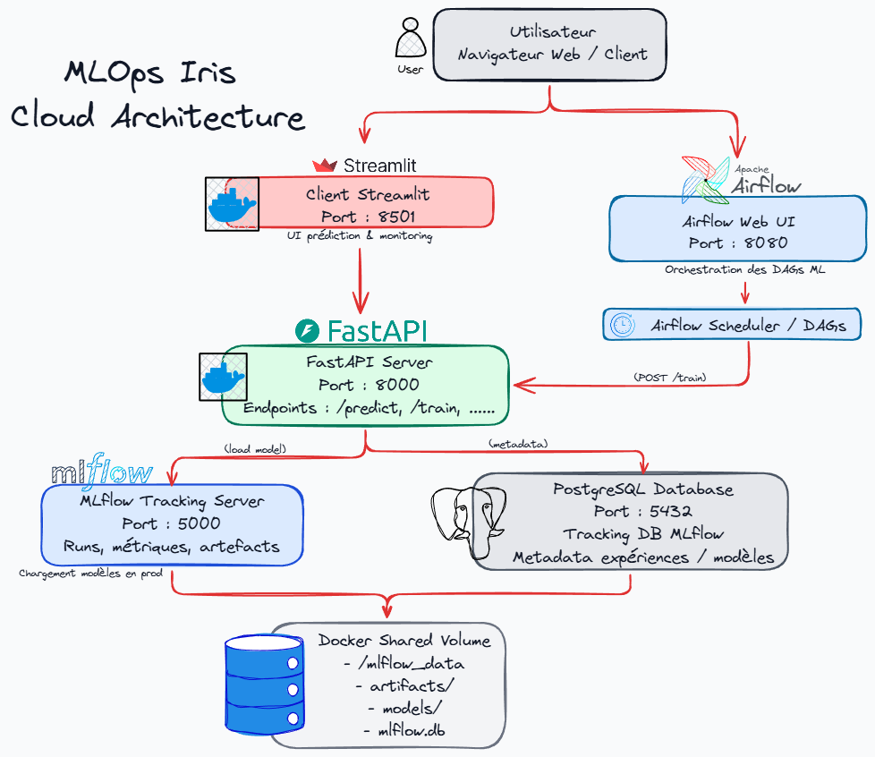
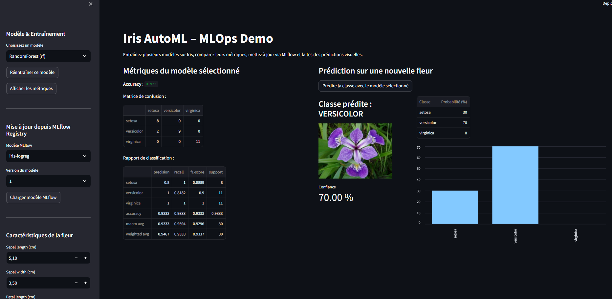
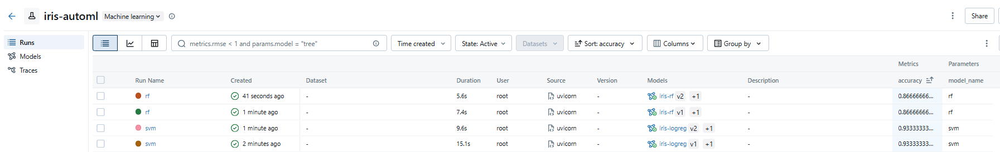
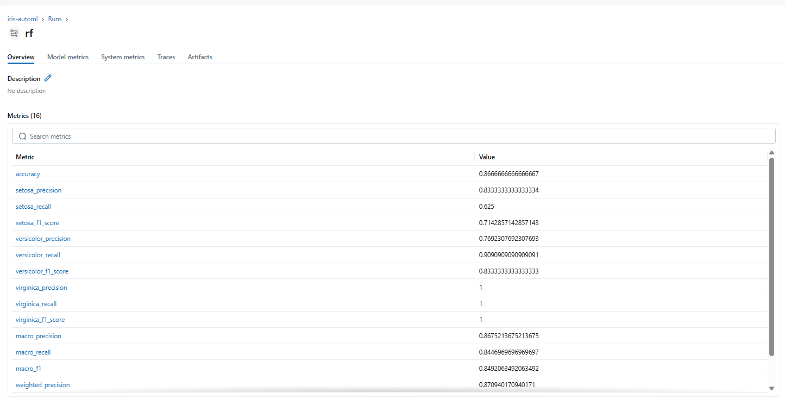
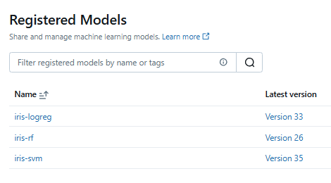
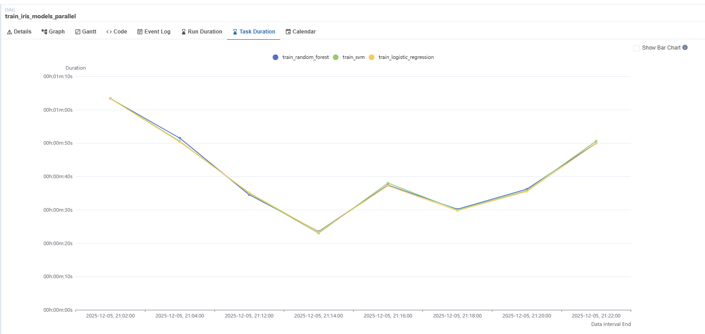

# Iris AutoML - MLOps Pipeline Complete

[](https://www.python.org/downloads/)
[](https://fastapi.tiangolo.com/)
[](https://streamlit.io/)
[](https://mlflow.org/)
[](https://airflow.apache.org/)
[](https://www.docker.com/)
[](LICENSE)

**Plateforme MLOps complète** pour l'entraînement, le versioning et le déploiement de modèles de classification sur le dataset Iris, avec orchestration automatisée et interface utilisateur interactive.


---

##  Aperçu

**Iris AutoML** est une plateforme MLOps end-to-end qui démontre les meilleures pratiques de Machine Learning Operations à travers un cas d'usage classique : la classification des fleurs Iris.


---

## Architecture

### Vue d'Ensemble

<p align="center">
  
</p>


## Infrastructure MLOps

<details>
<summary><strong>DATA INGESTION</strong></summary>

Scikit-learn Iris Dataset

</details>

<details>
<summary><strong>MODEL TRAINING (3 modèles)</strong></summary>

- RandomForest Classifier
- Support Vector Machine (SVM)
- Logistic Regression

</details>

<details>
<summary><strong>EXPERIMENT TRACKING</strong></summary>

MLflow (params, metrics, artifacts)

</details>

<details>
<summary><strong>MODEL REGISTRY</strong></summary>

MLflow Model Registry (versioning, staging, production)

</details>

<details>
<summary><strong>MODEL SERVING</strong></summary>

FastAPI REST API

</details>

<details>
<summary><strong>MONITORING & VISUALIZATION</strong></summary>

- MLflow UI (experiments & models)
- Streamlit (user interface)

</details>

<details>
<summary><strong>ORCHESTRATION</strong></summary>

Apache Airflow (scheduled / automated training)

</details>

---


## Pipeline MLOps

<details>
<summary><strong>1. DATA INGESTION</strong></summary>

Iris Dataset (scikit-learn)

</details>

<details>
<summary><strong>2. FEATURE ENGINEERING</strong></summary>

Pas de preprocessing (données déjà normalisées)

</details>

<details>
<summary><strong>3. MODEL TRAINING</strong></summary>

- RandomForest (100 trees, max_depth=None)  
- SVM (RBF kernel, C=1.0)  
- LogisticRegression (max_iter=200)

</details>


<details>
<summary><strong>4. MODEL EVALUATION</strong></summary>

- Accuracy  
- Precision, Recall, F1-Score (par classe)  
- Confusion Matrix  
- Classification Report

</details>


<details>
<summary><strong>5. EXPERIMENT TRACKING (MLflow)</strong></summary>

- Logging des hyperparamètres  
- Logging des métriques  
- Sauvegarde des artefacts (modèle, confusion matrix)  
- Metadata (git commit, user, timestamp)

</details>


<details>
<summary><strong>6. MODEL REGISTRY (MLflow)</strong></summary>

- Enregistrement dans le registry  
- Versioning automatique (v1, v2, v3...)  
- Staging (None, Staging, Production)  
- Transition entre stages

</details>

<details>
<summary><strong>7. MODEL SERVING</strong></summary>

- Chargement via FastAPI  
- Endpoints REST pour prédictions

</details>

<details>
<summary><strong>8. MONITORING</strong></summary>

- MLflow UI (performance tracking)  
- Logs applicatifs (Docker logs)  
- Airflow DAG monitoring

</details>

<details>
<summary><strong>9. RETRAINING (Airflow)</strong></summary>

Scheduled retraining (cron-based)

</details>

---

## Installation

### Installation Rapide

##### 1. Cloner le repository
```
git clone https://github.com/riadshrn/mlops-iris.git
cd mlops-iris
```


##### 2. Lancer tous les services
```
docker-compose up --build
```

##### 3. Attendre que tous les services démarrent (~2-3 minutes)


---

**IMPORTANT :** Au premier lancement, aucun modèle n'est encore disponible.

Lorsque vous ouvrez Streamlit pour la première fois (http://localhost:8501/), il est normal que :
- aucun modèle ne soit présent,
- aucune métrique ne soit affichée,
- les prédictions ne fonctionnent pas encore.

Aucun modèle n'a encore été entraîné.  
Deux options s'offrent à vous pour entraîner vos modèles.

--- 

#### OPTION 1 — Entraîner un modèle manuellement depuis Streamlit

Dans Streamlit :

1. Aller dans l'onglet "Réentraîner un modèle"
2. Choisir un modèle :
   - RandomForest
   - SVM
   - Logistic Regression
3. Cliquer sur "Réentraîner ce modèle"


#### OPTION 2 — Entraîner automatiquement les 3 modèles via Airflow

1. Ouvrir Airflow : http://localhost:8080/
   Identifiants :
   - username: admin
   - password: admin

2. Repérer le DAG : train_iris_models_parallel

3. Activer le DAG (switch ON)

Airflow exécutera automatiquement les entraînements toutes les 2 minutes :
- RandomForest
- SVM
- Logistic Regression

---

##### 4. Charger un modèle depuis MLflow Registry dans Streamlit

Une fois un modèle entraîné :

1. Aller dans l'onglet "Mise à jour depuis MLflow Registry"
2. Sélectionner :
   - modèle (rf, svm, logreg)
   - version (v1, v2, v3…)
3. Cliquer sur "Charger le modèle"

Streamlit affichera :
- accuracy
- métriques détaillées
- rapport de classification
- matrice de confusion
- modèle utilisé


<p align="center">
  
</p>

Les modèles seront :
- loggé dans MLflow Tracking,
- enregistré dans MLflow Model Registry,
- sauvegardé en artefact local.

#### Visualiser tous les modèles dans MLflow Tracking UI

Ouvrir MLflow : http://localhost:5000/

Dans l'experiment "iris-automl", vous verrez :
- toutes les exécutions (runs),
- les hyperparamètres,
- les artefacts (confusion matrix, metrics.json),
- les versions du Model Registry,
- les métriques globales et par classe.

Modèles visibles dans le registry :
- iris-rf (v1, v2, v3…)
- iris-svm (v1, v2, v3…)
- iris-logreg (v1, v2, v3…)


### Documentation Interactive

Accédez à la documentation Swagger interactive :
**http://localhost:8000/docs**

---


### Interface MLflow

#### MLFlow_models

<p align="center">
  
</p>

#### MLFlow_metrics
<p align="center">
  
</p>

#### MLFlow_Registred_model
<p align="center">
  
</p>

### Interface AirFlow

<p align="center">
  
</p>


---

<div align="center">

**⭐ Si ce projet vous a été utile, n'hésitez pas à lui donner une étoile ! ⭐**

Made with ❤️ by [Riad](https://github.com/riadshrn)

</div>